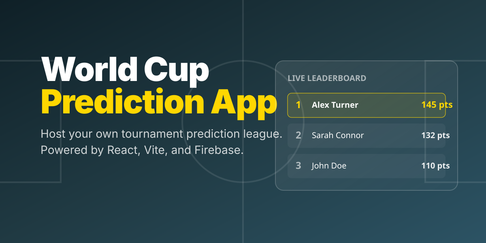

<p align="center">
  
</p>

A full-stack React and Firebase application for hosting your own World Cup prediction tournament. Manage users, track live match results, and run a real-time leaderboard for your community.

## 🏆 What it is

This platform provides everything needed to run a predictions league:
- **User Dashboard:** Users can register, submit predictions for upcoming matches, and see how they stack up against friends on the global leaderboard.
- **Admin Panel:** Built-in admin controls to approve pending users, add new matches, update scores, and manage all predictions.
- **Real-time Leaderboard:** Powered by Firebase to instantly reflect points when admins update match results.

## 🛠️ How it works

1. **Sign Up & Approval:** Users register for an account. Admins review and approve them via the **Pending Users** dashboard.
2. **Predict:** Users lock in their predictions before match kickoff.
3. **Score:** Admins input the final match results. Points are automatically calculated and the leaderboard updates in real-time.

## 🚀 Getting Started

### Prerequisites

- [Node.js](https://nodejs.org/) installed
- A Firebase project with Authentication and Firestore enabled.

### Installation

1. **Clone the repository:**
   ```bash
   git clone https://github.com/your-username/world-cup-prediction.git
   cd world-cup-prediction
   ```

2. **Install dependencies:**
   ```bash
   npm install
   ```

3. **Environment Setup:**
   Create a `.env` file in the root based on `.env.example` and add your Firebase configuration:
   ```env
   VITE_FIREBASE_API_KEY=your_api_key
   VITE_FIREBASE_AUTH_DOMAIN=your_auth_domain
   VITE_FIREBASE_PROJECT_ID=your_project_id
   VITE_FIREBASE_STORAGE_BUCKET=your_storage_bucket
   VITE_FIREBASE_MESSAGING_SENDER_ID=your_messaging_sender_id
   VITE_FIREBASE_APP_ID=your_app_id
   ```

4. **Run the development server:**
   ```bash
   npm run dev
   ```

## 🏗️ Architecture

- **Frontend:** React 19, Vite, React Router v7, Lucide React (Icons)
- **Backend/Database:** Firebase (Auth & Firestore)
- **Styling:** CSS Modules / Vanilla CSS

<br/>
<p align="center">
  <i><a href="https://github.com/oil-oil/beautify-github-readme">README DESIGNED WITH BEAUTIFY-GITHUB-README</a></i>
</p>
